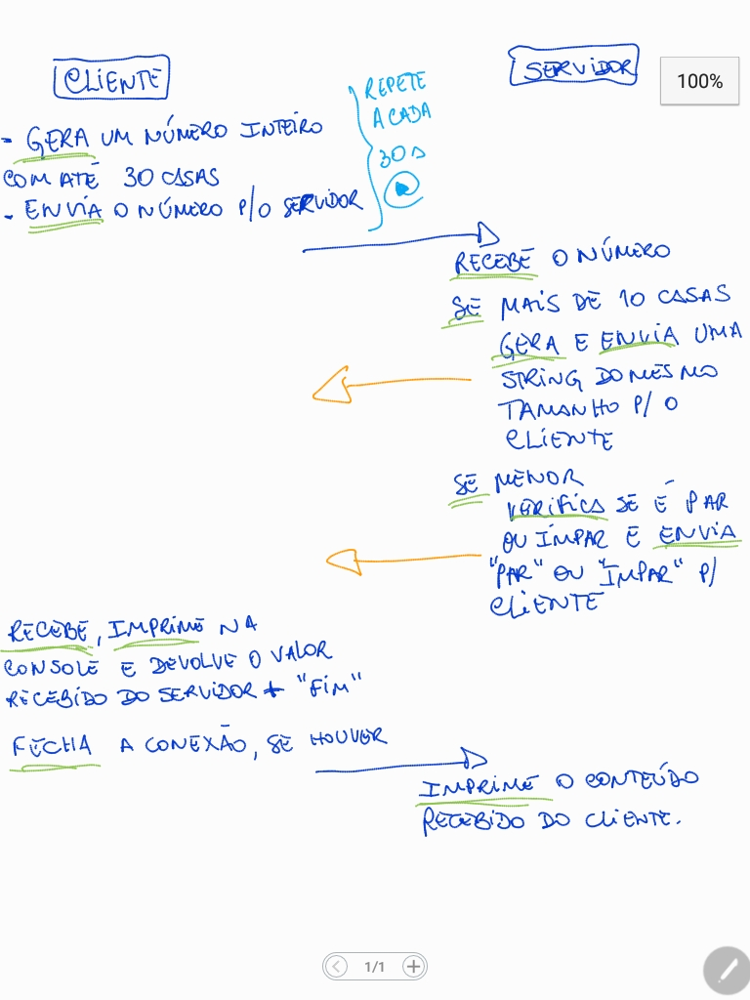

# Simple application using socket through TCP and UDP transport protocol for a network subject of Engineering on CEFET-MG

## To run this project, firstly run in terminal:
```shell
    .\server.py 
    #or 
    python server.py
```

## and afterwards run in another terminal window:

```shell
    .\client.py 
    #or 
    python client.py
```


## The schema is below:
